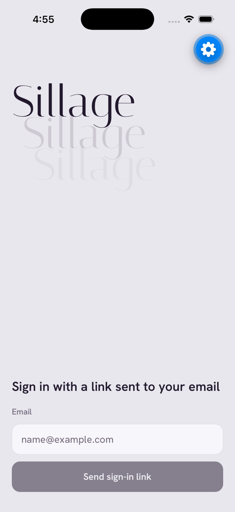
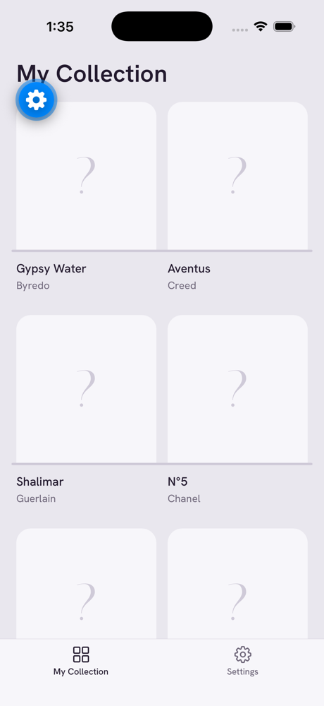
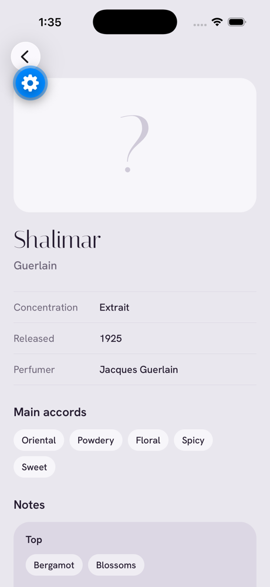
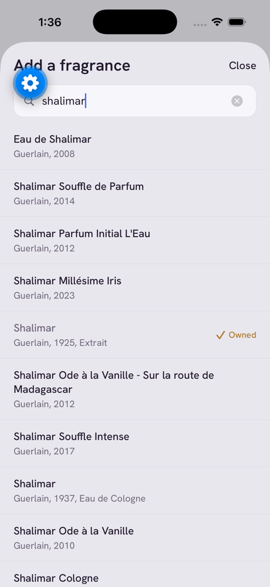
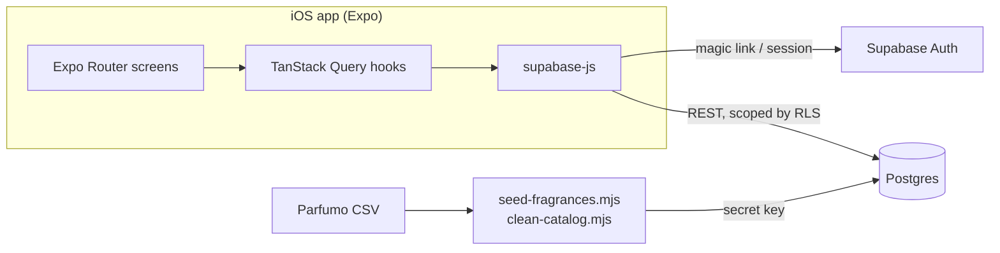
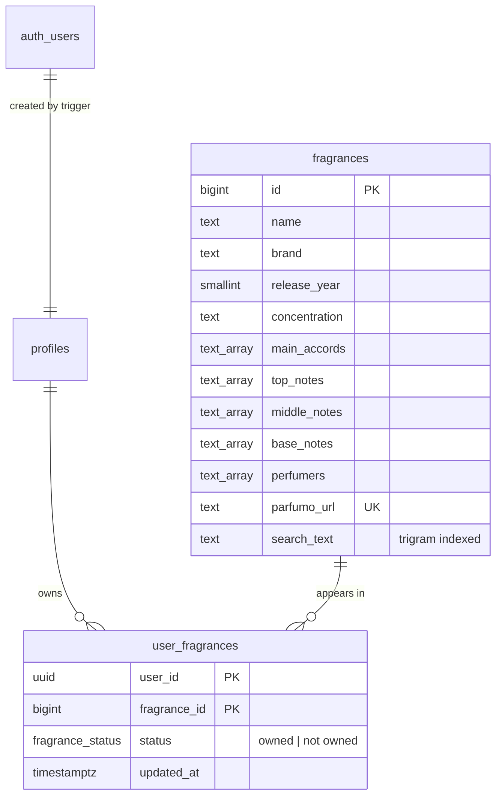

# Sillage

A fragrance collection tracker for iOS. Keep a shelf of the bottles you own, look up their notes, and search a
catalog of more than 59,000 perfumes.

_Sillage_ (French for "wake") is the trail of scent a perfume leaves behind.

<p align="center">
  
  
  
  
</p>
<p align="center"><sub>Screenshots from a development build running in Expo Go (the blue button is Expo's dev tools).</sub></p>

## Features

- **Passwordless sign-in** with a magic link sent by email.
- **My Collection**: owned fragrances displayed as bottles on shelves in a two-column grid, ending with a "+" slot.
- **Fragrance details**: concentration, release year, perfumers, main accords, and a notes pyramid whose top, heart,
  and base bands deepen in tone.
- **Search and add**: accent-insensitive, multi-word search across brand and name, with a confirm step. Fragrances
  you already own are marked.
- **Long-press to remove** a bottle from your collection, with an optimistic update.
- **Settings** with sign out.

## Tech stack

| Layer   | Tools                                                                            |
| ------- | -------------------------------------------------------------------------------- |
| App     | React Native, Expo SDK 57, Expo Router (typed routes), TypeScript                |
| Data    | TanStack Query, `supabase-js`                                                    |
| Backend | Supabase: Auth (magic links), Postgres with row-level security, `pg_trgm` search |
| Catalog | Node script that cleans the Parfumo CSV and seeds Postgres                       |
| Tooling | ESLint, Prettier, generated database types                                       |

## How it works

### Architecture



The app talks to Supabase directly with the publishable key. Row-level security does the authorization: anyone signed in
can read the catalog, and each user can only read and change their own collection. The secret key is used only by the
seed script on your machine.

### Data model



- Collection membership is a status enum rather than a boolean, so it can later grow into states like "wishlist" or
  "sampled". Removing a fragrance marks it `not owned` instead of deleting the row.
- Search matches every word of the query against a lowercased, accent-free `search_text` column with a trigram index,
  so queries like `ecarlate` find "Tabac Écarlate".

### Cleaning the catalog

The source data is the [TidyTuesday Parfumo dataset](https://github.com/rfordatascience/tidytuesday/tree/main/data/2024/2024-12-10)
(59,325 rows). It needed real cleanup before it was usable, which lives in
[`scripts/lib/clean-catalog.mjs`](scripts/lib/clean-catalog.mjs):

- **Split-off numbers:** the CSV moved leading numbers out of about 1,400 names, turning "24, Faubourg" into
  ", Faubourg" and replacing names that were only a number with the brand. The cleaner restores them, using the Parfumo
  URL to decide spacing ("360° Red for Men", "5th Avenue NYC").
- **Repeated suffixes:** 13.7k names repeated the brand, year, and concentration ("Joop! Homme Joop! 1989 Eau de
  Toilette"). The suffix is dropped only when it matches that record's own fields.
- **Corrupted and noisy values:** names corrupted to `#NAME?` are rebuilt from the URL, role labels are stripped from
  perfumer names ("Jane Doe Brand owner"), and spelling variants of notes and concentrations are unified.
- **Duplicates:** listings are merged only when their notes and perfumers don't conflict, so different releases that
  share a name stay separate.

Run `npm run seed:fragrances -- --dry-run` to preview what the cleaner changes without touching the database.

**Known issue: fabricated notes.** The source CSV contains notes that don't exist in perfumery, mixed into otherwise
real note lists: invented words like "Zorplox" and "Quarklox", and revolting descriptors like "Carrion" and "Burnt
Electronics". About 5,800 of these entries appear across roughly 3,850 fragrances. They're left in the data for now,
so some fragrance pages show them.

### Design

The visual concept is a vitrine: bottles displayed on glass shelves. The palette is cool lavender-grey (Mist, Vitrine)
with aubergine text (Ink) and an amber accent (Resin) reserved for adding things. Headings use Italiana, a didone
reminiscent of perfume labels, and the interface uses Hanken Grotesk. Tokens live in
[`src/constants/theme.ts`](src/constants/theme.ts).

## Getting started

### Prerequisites

- Node.js 20.6 or later (the scripts use `--env-file`)
- Xcode with an iOS Simulator, or the Expo Go app on an iPhone
- A [Supabase](https://supabase.com) project

### 1. Install

```bash
git clone https://github.com/samaksh-bajaj/sillage-fragrance-tracker.git
cd sillage-fragrance-tracker
npm install
```

### 2. Set up Supabase

1. Apply the SQL files in [`supabase/migrations`](supabase/migrations) in filename order, either with
   `supabase db push` after `supabase link`, or by pasting them into the SQL editor.
2. In **Authentication → URL Configuration**, add these redirect URLs:
   - `exp://**` (Expo Go)
   - `sillage://**` (standalone builds)
3. Supabase's built-in email sender only delivers to members of your Supabase organization. To let anyone else sign
   in, set up custom SMTP under **Authentication → SMTP**.

### 3. Configure environment variables

```bash
cp .env.example .env
cp .env.local.example .env.local
```

| File         | Variable                               | Used by                         |
| ------------ | -------------------------------------- | ------------------------------- |
| `.env`       | `EXPO_PUBLIC_SUPABASE_URL`             | App and scripts                 |
| `.env`       | `EXPO_PUBLIC_SUPABASE_PUBLISHABLE_KEY` | App                             |
| `.env.local` | `SUPABASE_SECRET_KEY`                  | Seed script only, never bundled |

Both files are gitignored.

### 4. Load the catalog

```bash
npm run seed:fragrances
```

This downloads the CSV, cleans it, and upserts about 59k fragrances. It's safe to re-run.

### 5. Run the app

```bash
npm run ios
```

## Scripts

| Command                   | What it does                                    |
| ------------------------- | ----------------------------------------------- |
| `npm start`               | Start the Expo dev server                       |
| `npm run ios`             | Start the dev server and open the iOS Simulator |
| `npm run seed:fragrances` | Clean the CSV and load it into Supabase         |
| `npm run typecheck`       | Type-check with TypeScript                      |
| `npm run lint`            | Lint with ESLint                                |
| `npm run format`          | Format with Prettier (`format:check` to verify) |

## Project structure

```
src/
  app/                  Expo Router screens
    (tabs)/             My Collection and Settings tabs
    fragrance/[id].tsx  Fragrance details
    add.tsx             Search and add (modal)
    sign-in.tsx         Magic-link sign-in
  components/           Grid, notes pyramid, action sheet, buttons
  constants/theme.ts    Colors, fonts, spacing
  lib/                  Supabase client, auth provider, queries, search helpers, generated DB types
scripts/
  seed-fragrances.mjs   Downloads, cleans, and loads the catalog
  lib/clean-catalog.mjs Catalog cleaning rules
supabase/migrations/    Schema, row-level security, and grants
```

## Roadmap

- Bottle images (a "?" placeholder stands in for now)
- Filter the fabricated notes out of the catalog
- In-app account deletion and a custom email sender, both needed before an App Store release
- More collection states, like wishlist and sampled

## Data

Fragrance data comes from the [TidyTuesday 2024-12-10 dataset](https://github.com/rfordatascience/tidytuesday/tree/main/data/2024/2024-12-10),
which was collected from [Parfumo](https://www.parfumo.com). Sillage is a personal project and is not affiliated with
Parfumo.
